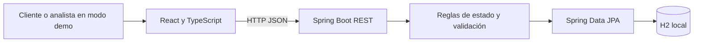
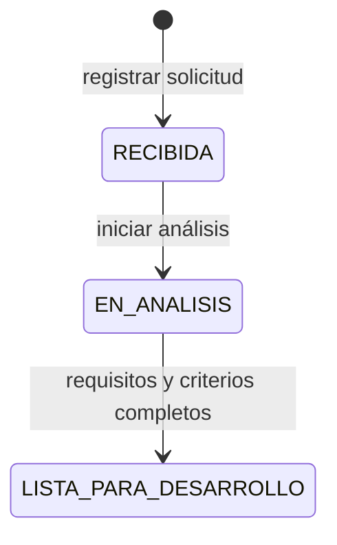

# Arquitectura y contrato de API

## Vista general



El frontend usa `/api` a través del proxy de Vite durante desarrollo. El backend persiste en `backend/data/`. No se requieren credenciales ni servicios en la nube para la demostración.

## Modelo principal

`ServiceRequest` contiene: `id`, `clientName`, `company`, `email`, `serviceType`, `title`, `description`, `status`, `requirements`, `acceptanceCriteria`, `createdAt` y `updatedAt`.

Los requisitos y criterios se guardan como texto multilinea en esta versión. Una evolución para producción podría separarlos en entidades con identificador, prioridad e historial de cambios.

## Estados



La API impide saltar estados. Una transición inválida devuelve HTTP 409.

## Endpoints

| Método | Ruta | Uso | Respuesta |
| --- | --- | --- | --- |
| GET | `/api/requests` | Listar por actualización reciente | 200 |
| GET | `/api/requests/{id}` | Consultar detalle | 200 o 404 |
| POST | `/api/requests` | Crear solicitud | 201 o 400 |
| POST | `/api/requests/{id}/analysis` | Iniciar análisis | 200, 404 o 409 |
| PUT | `/api/requests/{id}/analysis` | Guardar requisitos y criterios | 200, 400, 404 o 409 |
| POST | `/api/requests/{id}/ready` | Confirmar lista para desarrollo | 200, 404 o 409 |

Ejemplo de creación:

```json
{
  "clientName": "Ana Pérez",
  "company": "Panadería Ana",
  "email": "ana@ejemplo.com",
  "serviceType": "Comercio digital",
  "title": "Pedidos en línea",
  "description": "Necesito recibir pedidos y confirmar el total."
}
```

Ejemplo de análisis:

```json
{
  "requirements": "El cliente puede agregar productos al pedido.",
  "acceptanceCriteria": "Al confirmar, el sistema muestra el total correcto."
}
```

## Decisiones y límites

- **H2 local:** prioriza que la demo arranque en cualquier laptop sin configurar PostgreSQL.
- **Sin autenticación:** las vistas muestran el flujo de dos roles, pero no protegen datos. Es la principal tarea antes de un despliegue real.
- **Validación en backend:** los estados y campos requeridos se verifican también en la API, incluso si una llamada no proviene de la interfaz.
